# JavaScript 函数讲解(reveal-md)

---

什么是函数(Function)?

----

MDN上的定义

* 函数是Javascript程序的基本组成部分。
* 在Javascript中函数是用来执行一个过程或者运算一个数据结果的一堆语句的集合。
* 如要使用函数，则需要在某个作用域中先定义它，然后再调用它。

----

Function是Javascript的内置对象

* Object
* String
* Number
* Function  ← 
* RegExp
* Math
* ...

---

定义函数

----

函数声明(ex1)

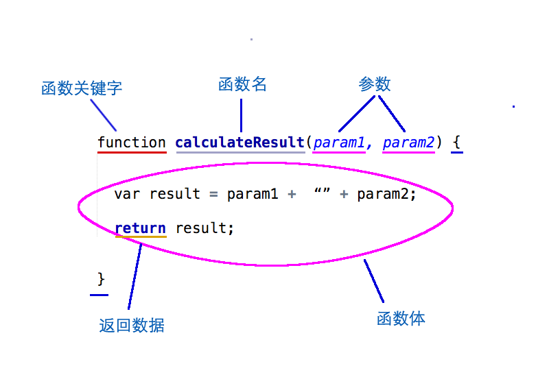

----

函数表达式

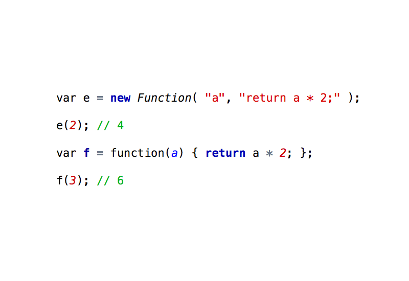

----

声明和表达式的区别 (ex2)

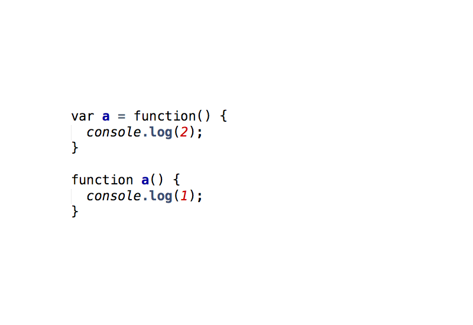

----

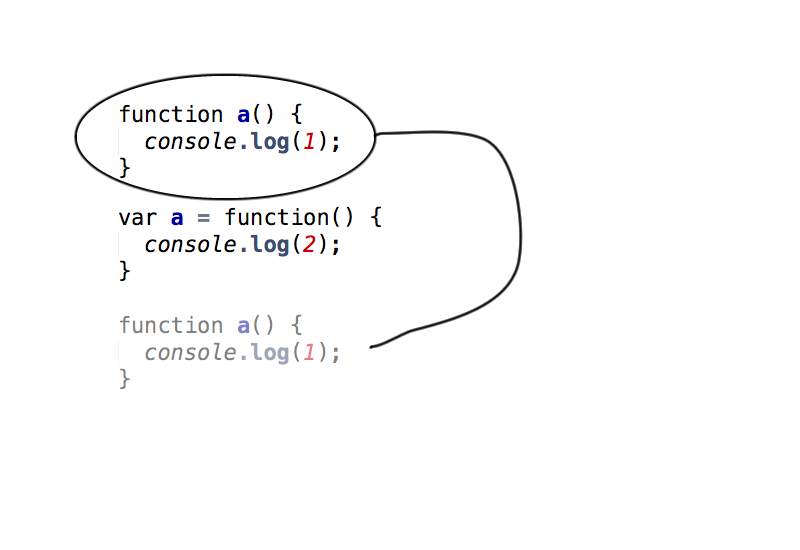

----

不要这样做!

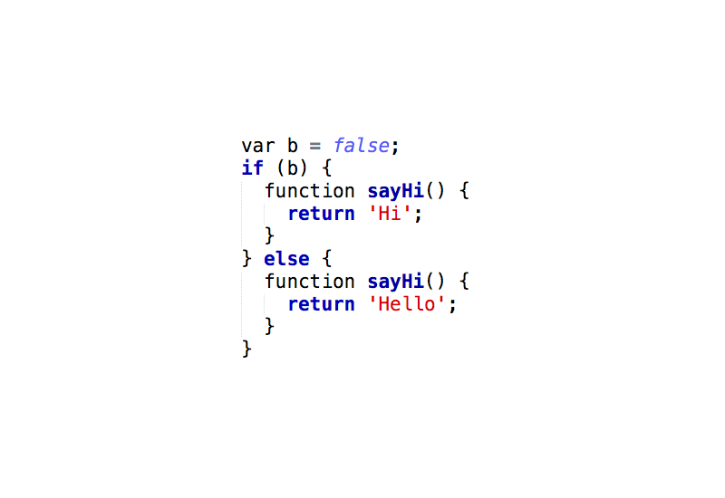

----

这样是可以的

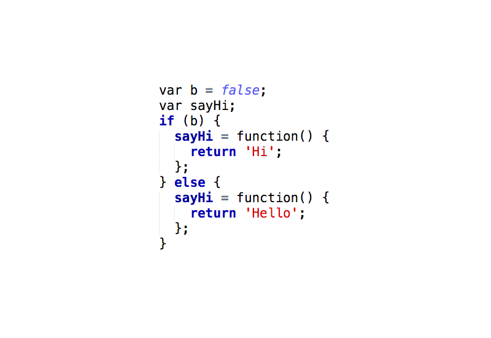

---

函数对象的属性和方法

----

arguments(ex3)

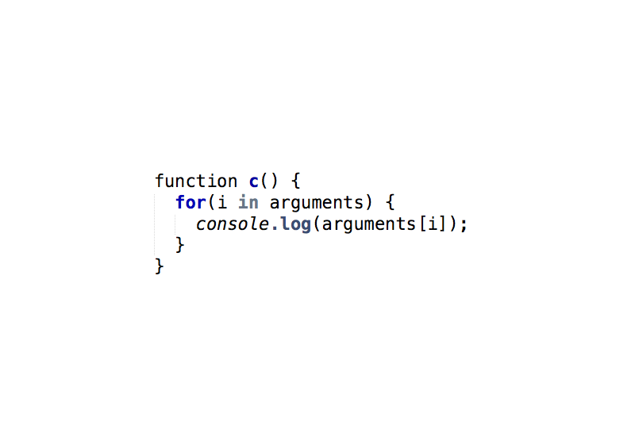

----

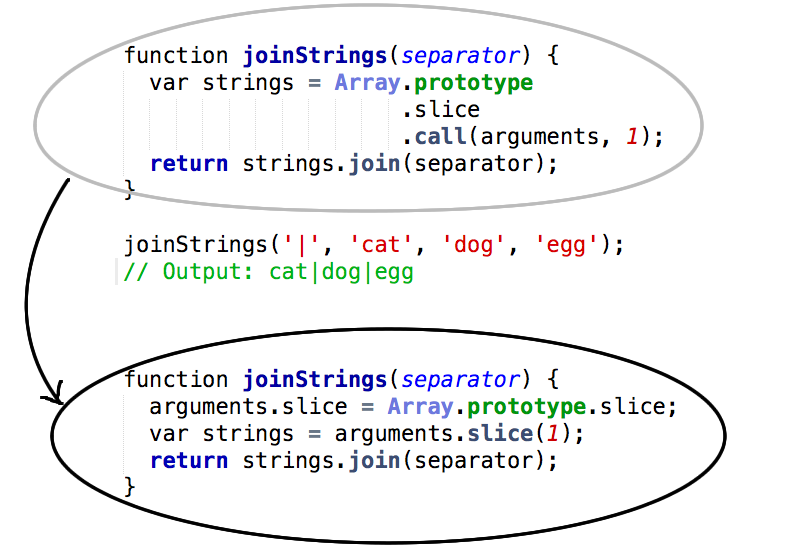

----

.call()和.apply()

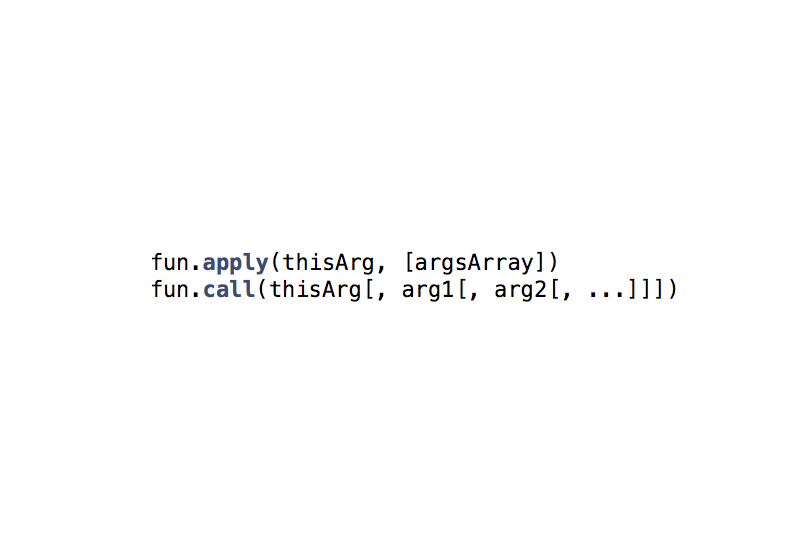

----

.bind()

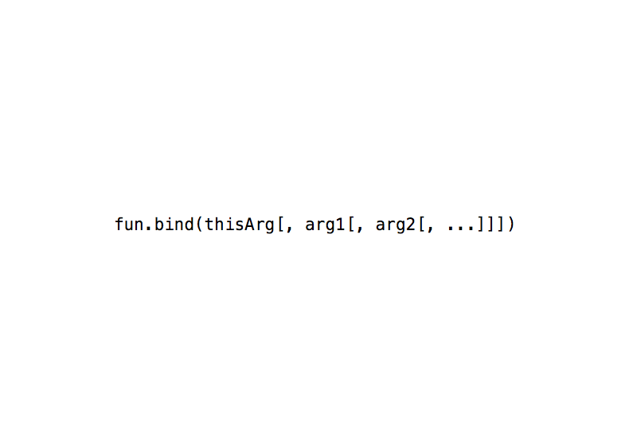

----

(ex4)

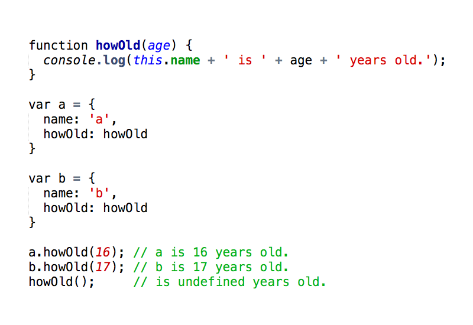

----

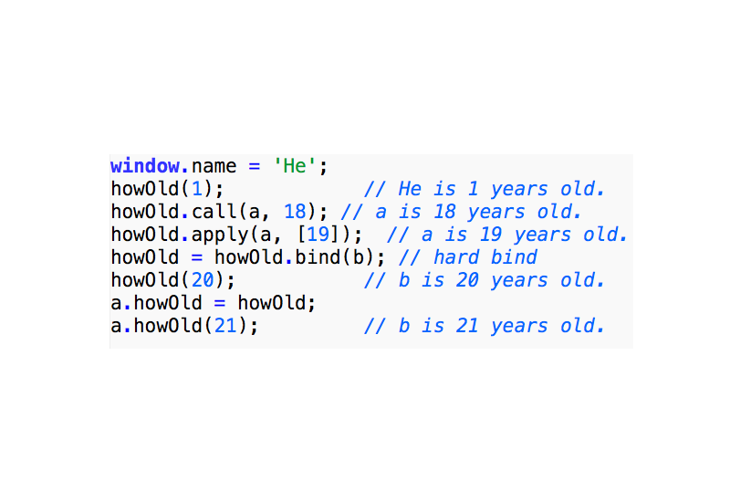

---

函数的应用

----

递归方法（ex5）

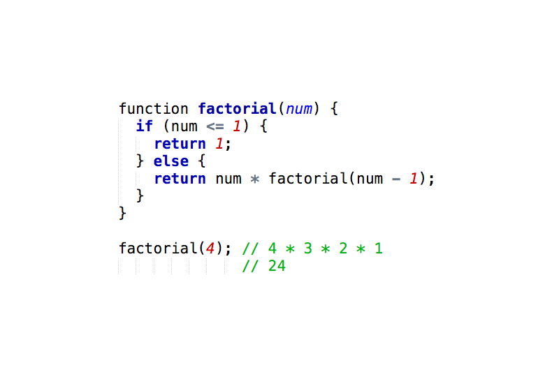

----

但是上面的写法是有错误的

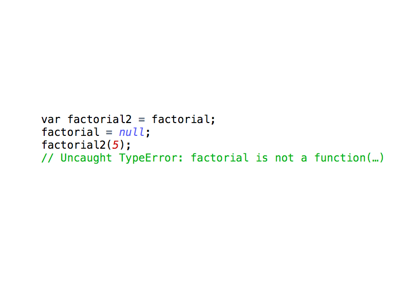

----

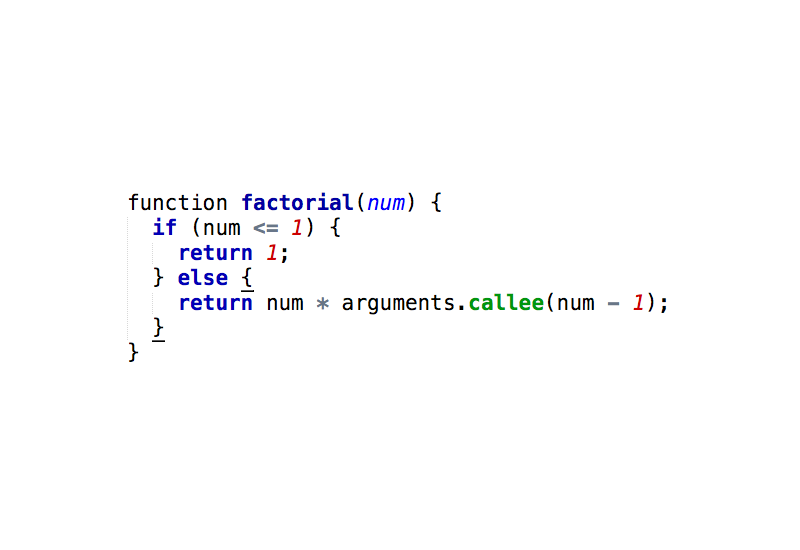

----

回调方法(ex6)

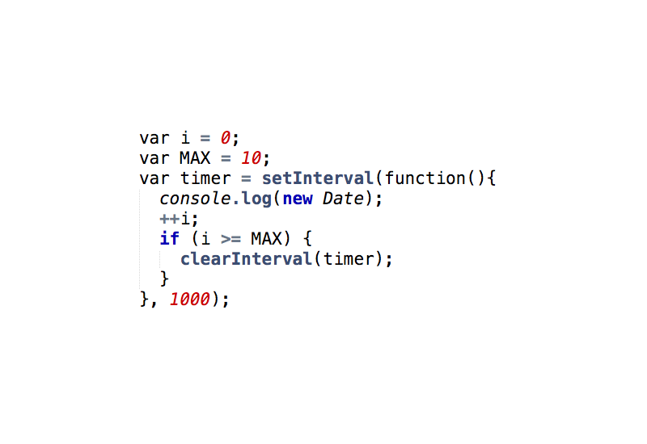

----

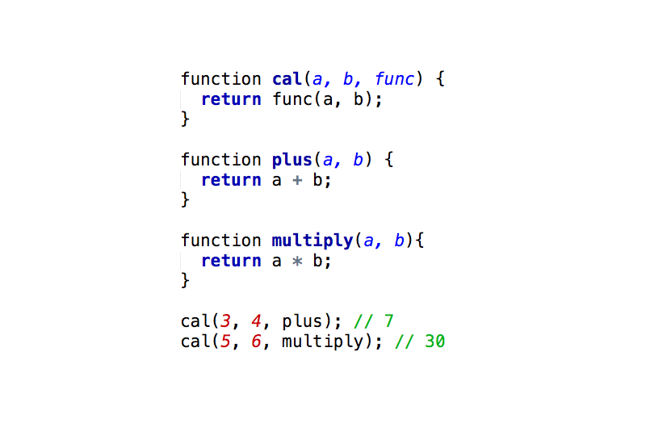

----

匿名方法(ex7)

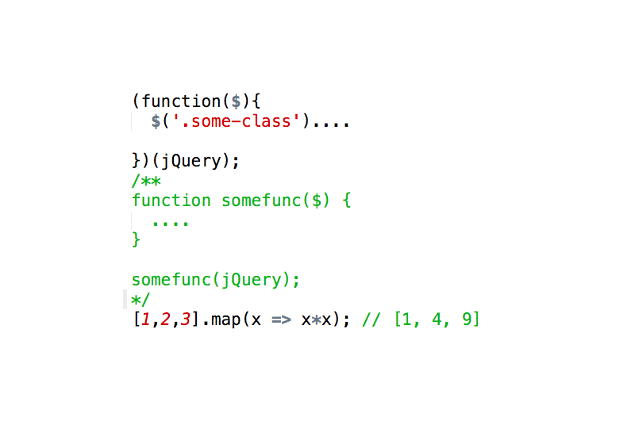

----

闭包(ex8)

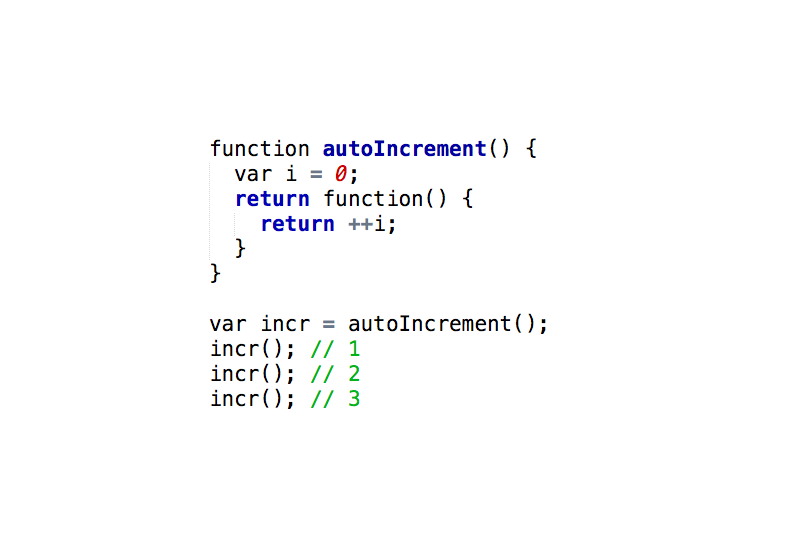

---

#The End @ 2016-06-06