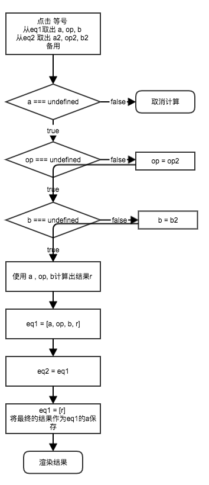
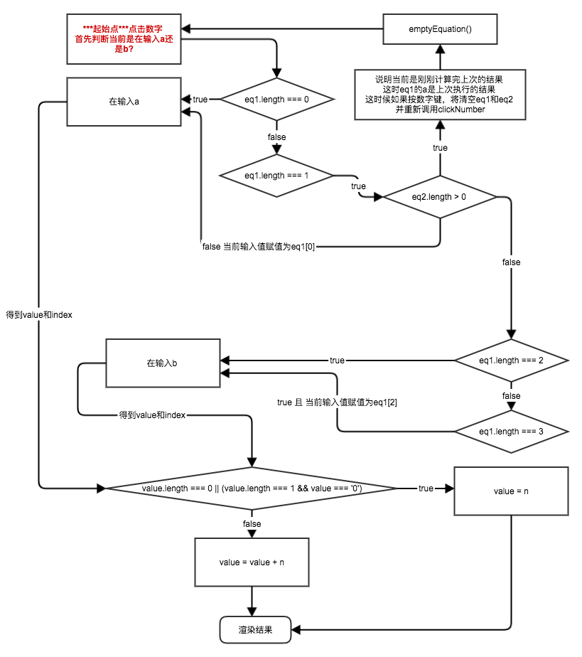

# 实战：计算器 [源码](cal.html)

## 代码解读

为了模仿OSX中的简易计算器(但也不是完全一样)，有以下结构，提前说明:
* 有两个全局变量eq1, eq2（eq是equation的意思），两个变量都是数组类型
* eq 结构是[a, op, b, r]  (r代表result)
* eq1保存当前的计算器输入的等式，eq2是上一次的等式

## 点击等号



## 点击数字按键


# 知识点

## DOM
理解 Document Object Model的树，通过DOM API可以遍历查询任何元素，并通过API可以修改元素的内容。

### 全局对象
* [window](https://developer.mozilla.org/en-US/docs/Web/API/Window)
* [location](https://developer.mozilla.org/en-US/docs/Web/API/Window/location)
* [history](https://developer.mozilla.org/en-US/docs/Web/API/Window/history)
* [navigator](https://developer.mozilla.org/en-US/docs/Web/API/Window/navigator)
* [document](https://developer.mozilla.org/en-US/docs/Web/API/Window/document)

### 查询DOM元素
* [document.getElementById](https://developer.mozilla.org/en-US/docs/Web/API/Document/getElementById)
* [document.getElementsByClassName](https://developer.mozilla.org/en-US/docs/Web/API/Document/getElementsByClassName)
* [document.getElementsByTagName](https://developer.mozilla.org/en-US/docs/Web/API/Document/getElementsByTagName)
* [document.querySelector](https://developer.mozilla.org/en-US/docs/Web/API/Document/querySelector) / [document.querySelectorAll](https://developer.mozilla.org/en-US/docs/Web/API/Document/querySelectorAll)

### 元素间的关系
* [element.children](https://developer.mozilla.org/en-US/docs/Web/API/ParentNode/children) 得到某元素下所有子元素列表
* [element.nextElementSibling](https://developer.mozilla.org/en-US/docs/Web/API/NonDocumentTypeChildNode/nextElementSibling) 得到某元素同级的下一个元素
* [element.previousElementSibling](https://developer.mozilla.org/en-US/docs/Web/API/NonDocumentTypeChildNode/previousElementSibling) 得到某元素同级的前一个元素
* [element.parentElement](https://developer.mozilla.org/en-US/docs/Web/API/Node/parentElement) 得到父级元素

### 读/写DOM元素属性
* [element.innerHTML](https://developer.mozilla.org/en-US/docs/Web/API/Element/innerHTML)
* [element.innerText](https://developer.mozilla.org/en-US/docs/Web/API/Node/innerText) 注意innerHTML 和 innerText的区别，前者对特殊字符不转义，后者转义（仅仅做必要转义，比如空格innerText也不会转）
* [element.className](https://developer.mozilla.org/en-US/docs/Web/API/Element/className)
```js
// 添加class
element.className = element.className.split(/\s+/).concat(newClassName).join(' ')
// 去除class
element.className = element.className.split(/\s+/).filter(c => c !== 要删除的className).join(' ')
```
* element.style
```js
element.style.background = 'rgb(0,0,0)'
element.style.width = '100px'
element.style.fontSize = '1.2em' // 注意css中两个单词组成的指令，会用-连接起来，在js代码中要用驼峰形式代替
```
* [element.getAttribute](https://developer.mozilla.org/en-US/docs/Web/API/Element/getAttribute) / [element.setAttribute](https://developer.mozilla.org/en-US/docs/Web/API/Element/setAttribute)
```js
element.getAttribute('href')
element.setAttribute('src', './loading.gif')
```

### 添加插入元素
* [element.append](https://developer.mozilla.org/en-US/docs/Web/API/ParentNode/append)
* [element.prepend](https://developer.mozilla.org/en-US/docs/Web/API/ParentNode/prepend)
* [element.insertAdjacentElement](https://developer.mozilla.org/en-US/docs/Web/API/Element/insertAdjacentElement)
* [element.insertAdjacentHTML](https://developer.mozilla.org/en-US/docs/Web/API/Element/insertAdjacentHTML)
* [element.insertAdjacentText](https://developer.mozilla.org/en-US/docs/Web/API/Element/insertAdjacentText)
* [element.remove](https://developer.mozilla.org/en-US/docs/Web/API/ChildNode/remove)
* [element.removeChild](https://developer.mozilla.org/en-US/docs/Web/API/Node/removeChild)

## 事件处理 [Event](https://developer.mozilla.org/en-US/docs/Web/API/Event) [MouseEvent](https://developer.mozilla.org/en-US/docs/Web/API/MouseEvent)
### onclick事件在html里的绑定方式
### event对象：用[event.target](https://developer.mozilla.org/en-US/docs/Web/API/Event/target) 获得当前事件的触发元素

----

## 以前的知识点：
switch / if ... else / 数组和字符串的一些基本使用